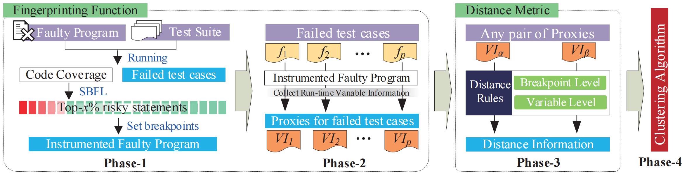
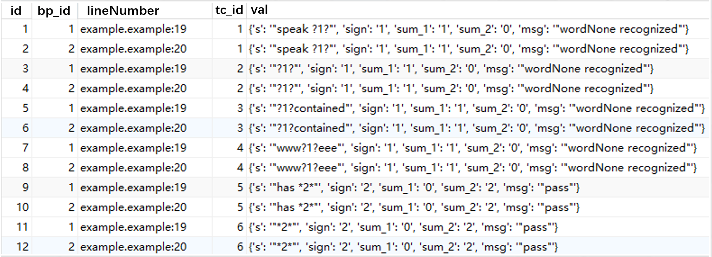
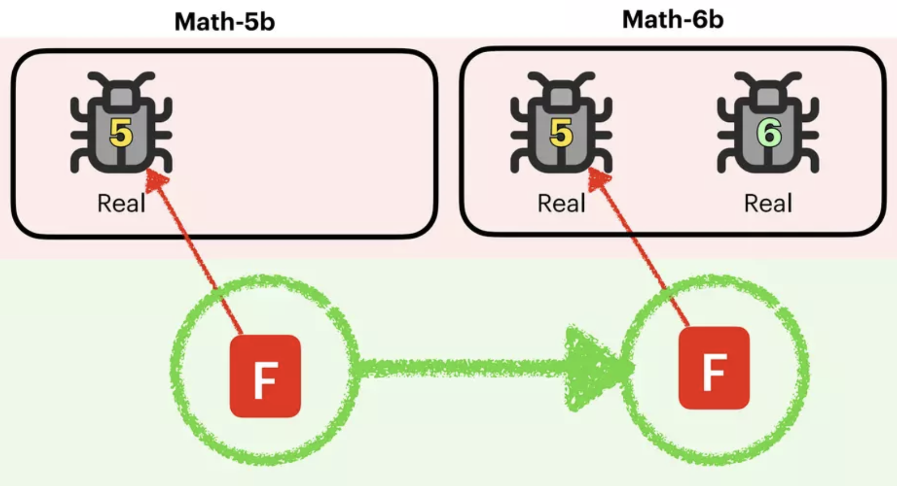

# Artifact for the Paper "ReClues: Representing and Indexing Failures in Parallel Debugging with Program Variables"

This is the artifact for the ICSE 2024 research paper "***ReClues: Representing and Indexing Failures in Parallel Debugging with Program Variables***". This artifact supplies the replication package (the code, the instructions for replicating our experiments, and the benchmark) as well as the supplementary material (the detailed running example presented in the paper). With the online available approach implementation and the concrete documents, we sincerely apply for the **Available Badge** and the **Reusable Badge**.


## Content

[1 Project Summary](#1-project-summary)<br>[2 Project Structure](#2-project-structure)<br>[3 Approach](#3-approach)<br>[4 Usage Instruction](#4-usage-instruction)<br>[5 Datasets](#5-datasets)

## 1 Project Summary

This ICSE 2024 research paper presents the program variable-based failure proximity, a deeper insight into extracting the signature of failures and thus representing them. On the basis of this failure proximity, we further propose a novel failure indexing approach, ReClues. ReClues utilizes the run-time values of program variables to represent failures, and designs a set of rules to measure the similarity between them. The goal of ReClues is to categorize failures into distinct groups according to the culprit root cause in multi-fault scenarios.

## 2 Project Structure

##### The meaning of the subfolders and files in this project:

  + ***ReClues-paper.pdf***

    The pdf file of the paper "ReClues: Representing and Indexing Failures in Parallel Debugging with Program Variables".

  + ***detailedExample.pdf***

    The completed version of the running example in the paper.

  + ***code/***

    + `Phase1/`
      + `getSpectrum.py` gets the spectrum from the code coverage.
      + `SBFL_Formula_DStar.py` calculates suspiciousness for program statements.
    + `Phase2/`
      + `get_GDB_var.py` is the collection script using GDB.
      + `get_JDB_var.py` is the collection script using JDB.
    + `Phase3/`
      + `caldistance_5.py`, `caldistance_10.py`, `caldistance_15.py`, and `caldistance_20.py` calculate the distance between a pair of failures with  the Top-5%, Top-10%, Top-15%, and Top-20% riskiest statements, respectively.
      + `caldistance_bonly.py` and `caldistance_vonly.py` calculate distance between a pair of failures by using only breakpoint level information and only variable level information, respectively.

    + `Phase4/`
      + `k_medoids.py` is the clustering algorithm, which enables all failures to be indexed to their own root cause.

  + ***dataset/***

    * `SIR/`
      * `$project/src` is the clean version of the C benchmark project.
      * `$project/AllMutants ($project).xls` is the mutants used to create faulty versions.
    * `Defects4J/`
      * `project/$project` is the faulty version of the Java benchmark project. 
      * `test/$project` provides the corresponding test cases.

  + ***runningExample_code/***

    * `example/`
      * `example_faulty.java` gives the faulty program of the running example.
    * `exampleTest/`
      * `exampleTest.java` gives all test cases of the running example. 
    * `lib/`
         * `junit-4.10.jar` gives the JUnit library required for running the examples.
         * `SingleJUnitTestRunner.java`  is used to run a single test case.
         * `*.class` The file ending with ".class" in this folder is the compiled Java 1.8 class file.
    * `input/` contains some necessary resources to start this example.
    * `output/` contains output files of each step of this example.

## 3 Approach

##### The overview of ReClues is shown as follows:



The mapping relationship between the phases in the framework and the source code is as follows:

`Phase-1` : **[getSpectrum.py](code/Phase1/getSpectrum.py)** and **[SBFL_Formula_DStar.py](code/Phase1/SBFL_Formula_DStar.py)**

`Phase-2` : **[get_GDB_var.py](code/Phase2/get_GDB_var.py)** and **[get_JDB_var.py](code/Phase2/get_JDB_var.py)**

`Phase-3` : **[caldistance_5.py](code/Phase3/caldistance_5.py)**, **[caldistance_10.py](code/Phase3/caldistance_10.py)**, **[caldistance_15.py](code/Phase3/caldistance_15.py)**, **[caldistance_20.py](code/Phase3/caldistance_20.py)** and

&emsp;&emsp;&emsp;&emsp;&emsp; **[caldistance_vonly.py](code/Phase3/caldistance_vonly.py)**, **[caldistance_bonly.py](code/Phase3/caldistance_bonly.py)**

`Phase-4` : **[k_medoids.py](code/Phase4/k_medoids.py)**


## 4 Usage Instruction

##### We provide users with experimental details and the usage instructions of the code.

For the sake of ease of use, here we use the running example presented in the paper (i.e., **[detailedExample.pdf](detailedExample.pdf)** in this repo) to instantiate the workflow of ReClues. The benchmark used in our experiment (i.e., SIR and Defects4J, which will be introduced in **[`dataset`](dataset/)**) can be run in the same way as this running example.


### Structure of the running example

The **[`runningExample_code`](runningExample_code)** directory contains the following folders and files:

- **[`example/`](runningExample_code/example/)**
  
  Containing the source code file of the faulty program containing two faults.

- **[`exampleTest/`](runningExample_code/exampleTest/)**

  Containing the source code file of the test cases code (containing six failures caused by two faults).

- **[`lib/`](runningExample_code/lib/)**

  Containing the JUnit library required for running the examples, and a tool file SingleJUnitTestRunner which is used to run a single test case.

- **[`input/`](runningExample_code/input/)**

  Containing the coverage information **[`input/example.pkl`](runningExample_code/input/example.pkl)** and the execution results of the test cases  **[`input/result-Example.csv`](runningExample_code/input/result-Example.csv)** for the faulty program. The coverage information can be obtained by the tool **[`Cobertura`]([Cobertura](https://cobertura.github.io/cobertura/))**.

- **[`output/`](runningExample_code/output/)**

  Containing output files of each step.


### Configure Environment for ReClues

ReClues depends on Python3 and some necessary libraries. So, please first install the Python3 interpreter and execute the following commands to install relevant libraries. 
*(We recommend using environment management tools (e.g., conda, virtualenv) to prepare a standalone Python environment for ReClues).*

```
conda create -n ReClues python=3.8
conda activate ReClues
pip install xlsxwriter==1.3.8
pip install numpy==1.20.2
pip install xlrd==1.2.0
pip install pandas==1.4.1
pip install pexpect==4.8.0
```

Please note that the code relies on the pexpect module, which is designed for Linux platforms. Therefore, it is required to run the code on a Linux system. In addition, please ensure that you have Java 1.8 installed on your system to run test cases. 

*Once the above installation is ready, the experiment can be replicated by the following steps.*

### Preparation

* First, clone the replication package from GitHub.

```shell
git clone https://github.com/yisongy/ReClues.git
```

* Second, go to the source code directory **[`code`](code)**.

```shell
cd code
```


### Step 1: **Determine breakpoints**

The coverage information stored in **[`input/example.pkl`](runningExample_code/input/example.pkl)** can be read by running the following code:

  ```python
  import pickle
  with open("../runningExample_code/input/example.pkl", "rb") as f:
      cov_info = pickle.load(f)
  print(cov_info)
  ```

The execution results of the test cases stored in **[`input/result-Example.csv`](runningExample_code/input/result-Example.csv)** reveal that among the 12 test cases, t1 ~ t6 are failed, and t7 ~ t12 are passed.

* Run **[`step_1.py`](code/step_1.py)**

```shell
python step_1.py
```

The script will calculate the suspiciousness value of the executable statements. The output of this step is **[`output/suspiciousness.xls`](runningExample_code/output/suspiciousness.xls)**. The output would look something like this. 

|     statement      | risk value |
| :----------------: | :--------: |
| example.example:19 |     12     |
| example.example:20 |     12     |
| example.example:21 |     12     |
| example.example:8  |     9      |
| example.example:9  |     9      |
| example.example:10 |     9      |
|         ……         |     ……     |

It is the risk value of being faulty of program statements. If we identify the Top-10% riskiest statements as breakpoints, the following two lines will be targeted:

```python
Line 19: String msg = sign == 1 ? "wordNone recognized" : "pass";
Line 20: msg = sign > 2 ? "wordNtwo recognized" : msg; // ==2
```

### **Step 2: Collect the run-time variable information of test cases**

* Run **[`step_2.py`](code/step_2.py)**

```shell
python step_2.py
```

In this step, six failed test cases will be executed to collect variable information at preset breakpoints.

The expected output is **[`output/variableInformation.db`](runningExample_code/output/variableInformation.db)**, which includes three tables.

The **testcase** table stores the names of the test cases and their execution result information. The output would look something like this. 

|  id  |              tc_name              | result |
| :--: | :-------------------------------: | :----: |
|  1   | exampleTest.exampleTest.testCase1 |   1    |
|  2   | exampleTest.exampleTest.testCase2 |   1    |
|  3   | exampleTest.exampleTest.testCase3 |   1    |
|  4   | exampleTest.exampleTest.testCase4 |   1    |
|  5   | exampleTest.exampleTest.testCase5 |   1    |
|  6   | exampleTest.exampleTest.testCase6 |   1    |


The **breakpoint** table stores information about the  statements marked as breakpoints, including their location and risk value. If everything runs smoothly, the output would look something like this. 

|  id  |    className    | method  | lineNumber | suspiciousnessValues |
| :--: | :-------------: | :-----: | :--------: | :------------------: |
|  1   | example.example | process |     19     |          12          |
|  2   | example.example | process |     20     |          12          |

The **bp_tc** table stores the runtime variable information collected for each test case.




### **Step 3: Calculate distance**

* Run **[`step_3.py`](code/step_3.py)**

```shell
python step_3.py
```

The script will calculate the distance between a pair of failures.

The expected output is **[`output/distance.csv`](runningExample_code/output/distance.csv)**, which contains the distance between any pair of failures. The expected outputs are as follows:

| pair  | distance |
| :---: | :------: |
| t1-t2 |   0.2    |
| t1-t3 |   0.2    |
| t1-t4 |   0.2    |
| t1-t5 |   0.8    |
| t1-t6 |   1.0    |
| t2-t3 |   0.2    |
| t2-t4 |   0.2    |
| t2-t5 |   1.0    |
|  ……   |    ……    |

If you want to calculate the distance between a pair of failures with other breakpoint determination thresholds, please call the corresponding codes in **[`Phase3`](code/Phase3)** in the same way.

### **Step 4: Index failures**

* Run **[`step_4.py`](code/step_4.py)**

```shell
python step_4.py
```

The script will run the clustering algorithm based on the previous distance, to enable all failures to be indexed according to the culprit root cause.

The expected output is **[`output/ReClues_clustering.xls`](runningExample_code/output/ReClues_clustering.xls)**, which contains the clustering result of all failures. The expected outputs are as follows:

| failure | failure indexing result |
| :-----: | :---------------------: |
|   t1    |            0            |
|   t2    |            0            |
|   t3    |            0            |
|   t4    |            0            |
|   t5    |            1            |
|   t6    |            1            |

The clustering process delivers two groups, {t1, t2, t3, t4} and {t5, t6}, which meet the expectations.


## 5 Datasets:

* **[`dataset/SIR`](dataset/SIR/)**:

  * We download four C projects from [SIR](https://sir.csc.ncsu.edu/portal/index.php): *flex*, *grep*, *gzip*, and *sed*, and then based on which create 1-bug, 2-bug, 3-bug, 4-bug, and 5-bug faulty versions by employing mutation strategies.
  * To create an *r*-bug faulty version (*r* = 1, 2, 3, 4, 5), we inject 1, 2, 3, 4, and 5 mutant(s) into the clean program, respectively. We employ an existing tool [yisongy/mutate.py: This is a simple script to perform mutation testing on c/c++ like programs (github.com)](https://github.com/yisongy/mutate.py) to perform mutation.

* **[`dataset/Defects4J`](dataset/Defects4J/)**:

  * We download five Java projects from [Defects4J](https://github.com/rjust/defects4j): *Chart*, *Closure*, *Lang*, *Math*, and *Time*, and then based on which search for 1-bug, 2-bug, 3-bug, 4-bug, and 5-bug faulty versions, according to the search strategy proposed by:

    `"Searching for Multi-Fault Programs in Defects4J", Gabin An, Juyeon Yoon, Shin Yoo, SSBSE 2021`

  * The following picture is from their **[`slides`](https://www.slideshare.net/GabinAn1/searching-for-multifault-programs-in-defects4j)**, showing how they transplant fault-revealing test cases to detect more faults that existed in the original faulty version. 

    


  * For more details regarding the generation of Defects4J multi-fault versions, please refer to [coinse/Defects4J-multifault: Artifact of "Searching for Multi-Fault Programs in Defects4J", SSBSE 2021 (github.com)](https://github.com/coinse/Defects4J-multifault).

If you use our paper for academic purposes, please cite it as:
```text
@inproceedings{songICSE2024,
  author    = {Yi Song and
               Xihao Zhang and 
               Xiaoyuan Xie and 
               Quanming Liu and
               Ruizhi Gao and
               Chenliang Xing},
  title     = {ReClues: Representing and Indexing Failures in Parallel Debugging with Program Variables},
  booktitle = {2024 IEEE/ACM 46th International Conference on Software Engineering (ICSE)},
  year      = {2024}
}
```
